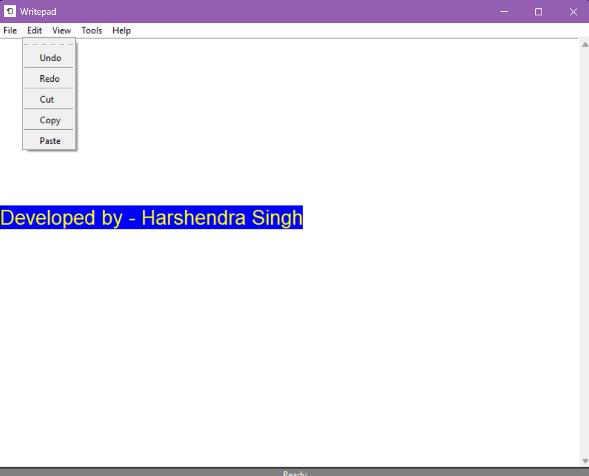

# 📝 WritePad

A modern desktop text editor built using **Python** and **Tkinter**.  
WritePad is a modular notepad application that provides essential text editing features with a clean and organized codebase.

---

## 📸 Preview
  
> 

---

## ✨ Features

### 📂 File
- New File
- Open File
- Save
- Save As
- Exit

### ✏ Edit
- Undo
- Redo
- Cut
- Copy
- Paste
- Select All

### 👀 View
- Dark Mode
- Light Mode
- Zoom In(not implemeted yet)
- Zoom Out(not implemented yet)
- Reset Zoom(not implemented yet)

### 📊 Status Bar
- Displays current editor status
- Updates after file operations

### 🖥 User Interface
- Menu Bar
- Scrollable Text Editor
- Status Bar
- Keyboard Friendly Layout

---

## 🏗 Project Structure

```text
WritePad/
│
├── main.py
│
├── gui/
│   ├── __init__.py
│   ├── window.py
│   ├── menu.py
│   ├── text_editor.py
│   ├── statusbar.py
│   └── dialogs.py
│
├── operations/
│   ├── __init__.py
│   ├── new_file.py
│   ├── open_file.py
│   ├── save_file.py
│   ├── save_as.py
│   ├── edit.py
│   └── view.py
│
├── utils/
│
├── assets/
│
└── README.md
```

---

## 🚀 Technologies Used

- Python 3
- Tkinter
- OS Module
- FileDialog
- MessageBox

---

## ⚙ Installation

Clone the repository

```bash
git clone https://github.com/your-username/WritePad.git
```

Go to the project folder

```bash
cd WritePad
```

Run the application

```bash
python main.py
```

---

## 🎯 Learning Objectives

This project was built to strengthen understanding of:

- Modular Python Programming
- GUI Development using Tkinter
- File Handling
- Event Driven Programming
- Desktop Application Development
- Code Organization
- Git & GitHub Workflow

---

## 📌 Future Improvements

- Find & Replace
- Word Count
- Auto Save
- Recent Files
- Multiple Tabs
- Themes
- Font Customization
- Line Numbers
- Syntax Highlighting
- Spell Checker

---

## 🤝 Contributing

Contributions, issues and feature requests are welcome.

Feel free to fork the repository and submit a pull request.

---

## 📄 License

This project is licensed under the MIT License.

---

## 👨‍💻 Developer

**Harshendra Singh**

Python Developer | AI & ML Enthusiast | Open Source Learner

If you like this project, consider giving it a ⭐ on GitHub."# Writepad" 
